# 01 - Google Play Crawler Architecture and System Overview

## 1. Executive summary

The Sahabino Google Play crawler is a standalone background subsystem that periodically collects two kinds of information for applications registered in Sahabino:

1. **Application statistics**, such as installs, score, rating count, review count, store update date, current version, and ad-support flag.
2. **Recent reviews**, currently limited to the newest 1,000 reviews per application, including review identity, source timestamp, score, content, author, thumbs-up count, and the review's position in the observed list.

The crawler does not decide which applications exist. It asks the **Application Registry API** for the active application list at the beginning of each crawl run. It also does not store the collected Google Play data in analytical tables. Instead:

- **PostgreSQL** stores the crawler's operational lifecycle: crawl runs, tasks, attempts, statuses, timestamps, and safe failure information.
- **Kafka** carries the collected app-statistics and review-observation events to future or separate consumers.

A useful mental model is:

> The crawler is a reliable collection-and-publication worker. PostgreSQL answers "what happened to the crawl?" while Kafka answers "what data did the crawl collect?"

## 2. What happens during a normal crawl

A normal scheduled run can be understood without knowing the implementation language:

1. The scheduler starts a crawl run.
2. The crawler records the new run in PostgreSQL.
3. It asks the Application Registry API for all active applications.
4. It creates two lifecycle tasks for each application:
   - `app_details`
   - `reviews`
5. It processes several applications in parallel, up to a configured limit.
6. Within a single application, `app_details` runs first and `reviews` runs second.
7. Each operation uses resilience controls to avoid overloading Google Play and to recover from transient failures.
8. Collected data is normalized into Sahabino-owned DTOs, not passed downstream in third-party-library shapes.
9. The crawler publishes the normalized data to Kafka.
10. Each task is marked succeeded or failed independently.
11. The run is finalized from the task outcomes.

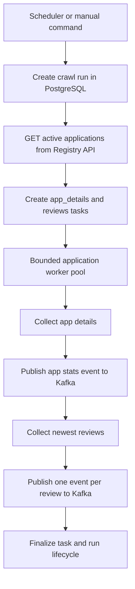

## 3. System context

The crawler lives between the application registry, Google Play, PostgreSQL, and Kafka.

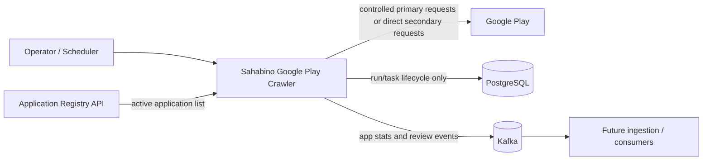

### Boundary rules

The current implementation deliberately keeps several boundaries explicit:

- The crawler gets active applications through `GET /applications?active=true`; crawler business logic does not query the `applications` table directly.
- The crawler writes only execution lifecycle state to its PostgreSQL tables: `crawl_runs` and `crawl_tasks`.
- App statistics and reviews are published as versioned Kafka events.
- Kafka topic provisioning and database migrations are explicit operational steps, not hidden crawler-startup side effects.

## 4. Purpose and non-goals

### 4.1 Purpose

The crawler is responsible for:

- periodically discovering active applications through the Registry API;
- collecting app details and recent reviews from Google Play;
- normalizing third-party data into strict Sahabino contracts;
- applying bounded concurrency and local request pacing;
- applying retry, proxy health, fallback, and circuit-breaker policies;
- persisting observable crawl lifecycle state;
- publishing collected data through Kafka with a delivery boundary;
- making expected partial failure visible rather than turning every individual task failure into a whole-run crash.

### 4.2 Non-goals in the current implementation

The crawler is not responsible for:

- analytical storage of app snapshots or review history;
- deduplicating review revisions/observations into analytics tables;
- providing exactly-once behavior across PostgreSQL and Kafka;
- running database migrations automatically;
- provisioning Kafka topics during normal startup;
- dynamically discovering an official Google Play quota;
- health-checking unhealthy proxies in a background process;
- using the secondary scraper as an alternate-IP or anti-rate-limit strategy.

## 5. Architectural style

The crawler uses a practical **Hexagonal Architecture / Ports and Adapters** structure inside the wider Sahabino codebase.

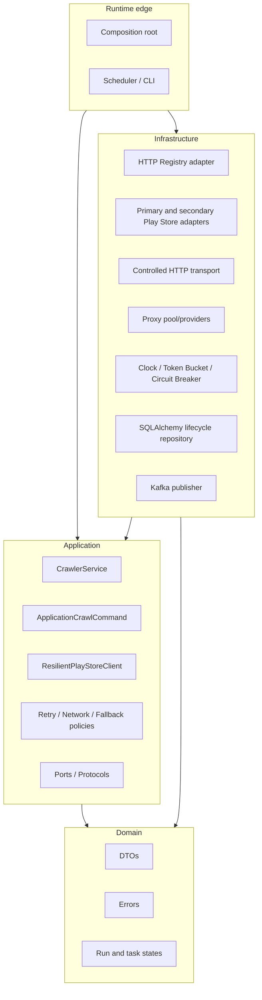

The important dependency rule is that the domain does not need to know about scraper libraries, `curl_cffi`, Kafka, SQLAlchemy, Tenacity, APScheduler, HTTPX, or proxy implementations. Application code owns the use cases and policy decisions; infrastructure implements external I/O.

## 6. Major building blocks

### 6.1 Scheduler and CLI

The crawler can be run manually or as a blocking scheduler process.

- `crawl-once` creates a manual run.
- `scheduler` creates scheduled runs at the configured interval.
- Scheduled execution runs immediately when the scheduler starts, then on the interval.
- Missed executions are coalesced.
- An in-process lock plus the scheduler's `max_instances=1` prevents overlapping scheduled runs in the same process.

### 6.2 Crawler service

`CrawlerService` owns one full crawl run:

- create the run;
- fetch active applications;
- create tasks;
- run bounded application commands;
- wait for worker completion;
- finalize the run.

The configured `playstore_max_concurrent_apps` controls how many application commands may be active at once. A value of `1` is the effective serial mode.

### 6.3 Application command

Each application is one concurrency unit. Inside that unit, the two operations are intentionally sequential:

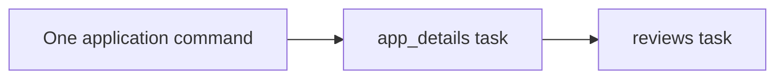

The tasks are operationally independent even though they are sequential. An expected crawler error in app details marks the details task failed and still allows the reviews task to run. The reverse is naturally possible: details can succeed and reviews can fail.

Unexpected programming/infrastructure exceptions are treated more seriously: the command marks open tasks failed and propagates the unexpected error to orchestration.

### 6.4 Resilient Play Store client

`ResilientPlayStoreClient` is shared, but `open_application(context_id)` creates an application-scoped client holding the egress lease and lazy primary adapter stack.

This is why app details and reviews can reuse the same network context until policy decides that the egress must change.

### 6.5 Primary adapter

The primary path is designed to keep network behavior under Sahabino's control:

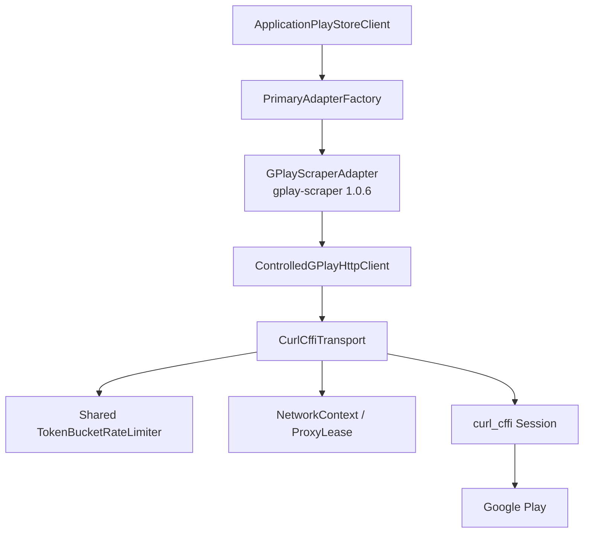

The primary integration deliberately bypasses the scraper library's normal decorated retry/fallback path. The adapter uses the pinned library's parser/scraper internals while injecting `ControlledGPlayHttpClient` as the only HTTP surface.

This is a strong coupling to `gplay-scraper==1.0.6`, but it gives the crawler ownership of:

- request rate;
- timeout;
- proxy usage;
- retry decisions;
- HTTP status classification;
- circuit behavior;
- resource lifecycle.

### 6.6 Secondary adapter

The secondary adapter uses `google-play-scraper==1.2.7` and is intentionally **direct-only and transport-uncontrolled**.

It exists to recover from a narrow category of primary implementation problems:

- `ParseFailure`
- `SchemaFailure`
- `AdapterFailure`

It is **not** used for:

- HTTP 429;
- 403/407;
- timeouts;
- proxy connection failures;
- 5xx upstream failures;
- missing/gone/restricted applications;
- invalid packages;
- local token wait failures.

This is a critical architectural rule: changing scraper implementation is not used as a substitute for changing network identity.

## 7. End-to-end runtime view

The following sequence shows the important ownership boundaries for one application operation.

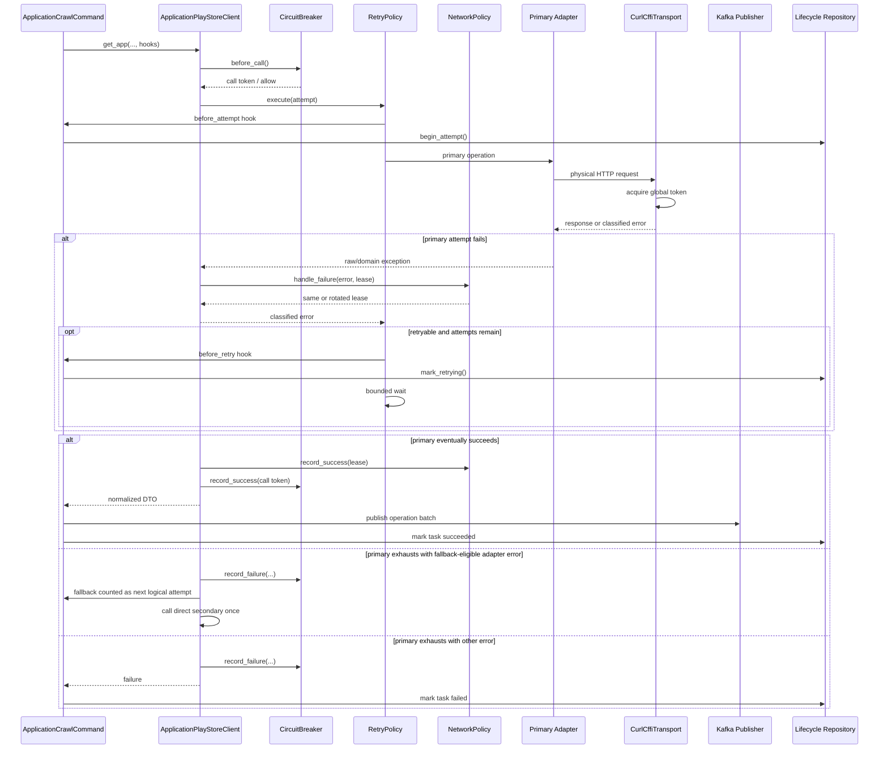

## 8. Attempts, retries, and physical requests

Three concepts must not be confused.

### Logical operation

A call such as "collect app details" or "collect reviews".

### Logical attempt

An execution attempt visible to lifecycle state. Primary retries each count as new attempts. If a fallback-eligible primary failure selects the secondary, the secondary is also counted as another logical attempt.

### Physical request

An actual outbound HTTP request. A single logical attempt can involve more than one physical request when an adapter/library protocol needs multiple requests. Physical requests consume token-bucket capacity; lifecycle attempt counting is not tied one-to-one to HTTP requests.

This distinction keeps operational bookkeeping meaningful and request pacing enforceable.

## 9. Lifecycle model

### 9.1 Run lifecycle

Runs are stored in `crawl_runs`.

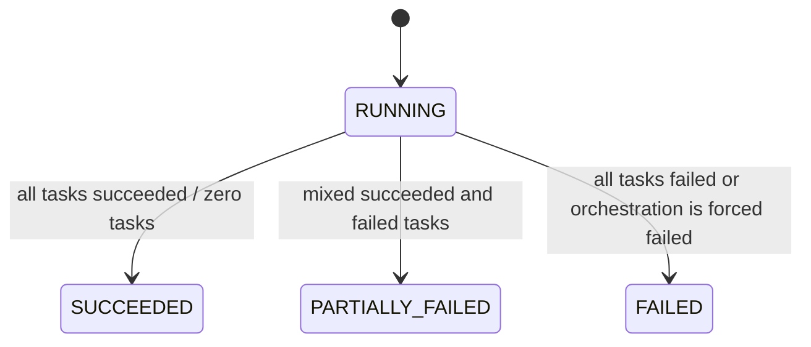

Although the enum includes `PENDING`, the current repository creates runs directly with status `running`.

A registry failure occurs after run creation but before task creation. In that case the run is forced to `failed` and the service returns the run ID.

### 9.2 Task lifecycle

Tasks are stored in `crawl_tasks`.

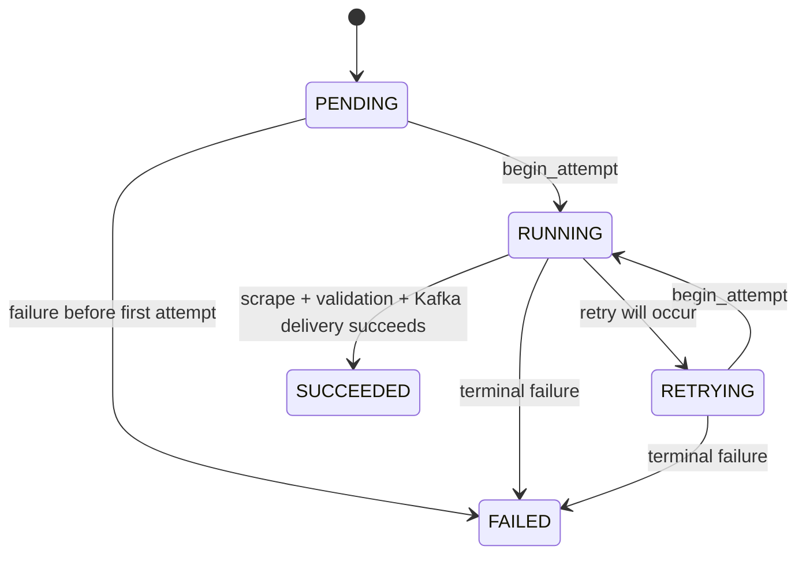

Important invariants:

- `attempt_count` increments only when `begin_attempt` succeeds.
- `started_at` records the first attempt and is not replaced by later retries.
- `finished_at` is set for terminal task states.
- error messages are bounded and sanitized to avoid leaking proxy URLs/credentials.

## 10. Concurrency model

Concurrency is at the **application level**, not the individual task level.

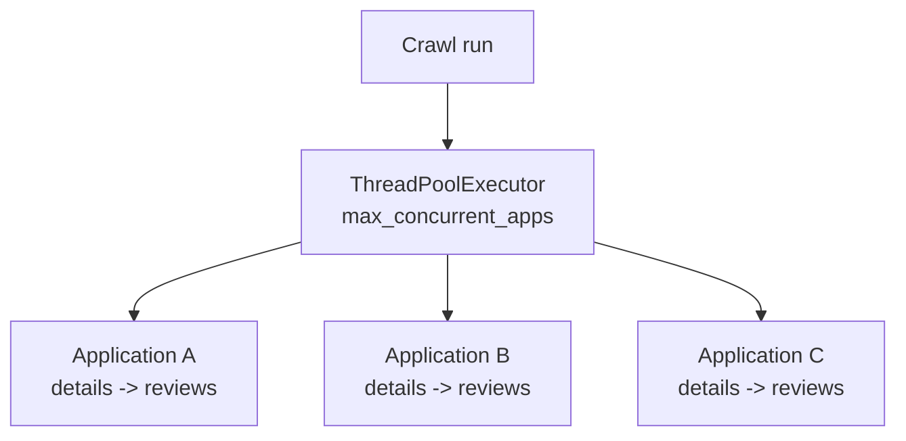

Consequences:

- Different applications may overlap.
- Details and reviews for the same application do not overlap.
- A shared token bucket still controls primary physical request pacing across all worker threads.
- The circuit breaker is process-wide, so evidence of a Google Play outage can stop new logical operations across applications.
- Proxy endpoint health is shared across contexts; leases are per context but not exclusive reservations of an endpoint.

## 11. Rate limiting

The crawler has a process-wide token bucket for the **controlled primary path**.

Default settings:

- refill: `1.0` token/second;
- burst capacity: `2` tokens;
- local maximum token wait inside `TokenBucketRateLimiter`: 60 seconds (constructor default, not currently a top-level setting).

Every primary physical request calls `acquire()` before network transmission. A token that was consumed for a transmitted attempt is not refunded after timeout, 429, 5xx, or another failure.

`LocalRateLimitWaitExceeded` is a local back-pressure error. It is not interpreted as a Google Play rate limit, proxy failure, or circuit failure.

**Scope note:** the direct-only secondary adapter does not use this controlled token bucket because it uses the third-party library's own network path.

## 12. Retry policy

Retry uses Tenacity behind an application-owned `RetryPolicy`.

- `max_attempts` means total attempts, not "initial attempt plus N retries".
- Exponential delay is approximately `2^(attempt-1) + jitter`, capped by the configured local maximum delay.
- For `RateLimited` and `UpstreamFailure`, a valid `Retry-After` is treated as a minimum wait and can therefore exceed the local backoff cap.
- Retry callbacks update the persisted task state to `retrying` only when another attempt will actually occur.

Retryable categories include:

- rate limiting;
- network timeout;
- temporary connection failure;
- proxy connection failure;
- upstream failure;
- 403 or 407 only when policy has established that retry with a new egress is valid.

Parser/schema/adapter failures do not consume repeated primary retries; they may select the secondary adapter instead.

## 13. Proxy and egress model

### 13.1 Lease semantics

A `ProxyLease` is a sticky mapping between a `context_id` and an egress choice. It is not an exclusive reservation of a proxy endpoint. Multiple application contexts can use the same endpoint.

Direct mode is represented by a lease with no endpoint.

### 13.2 Proxy states

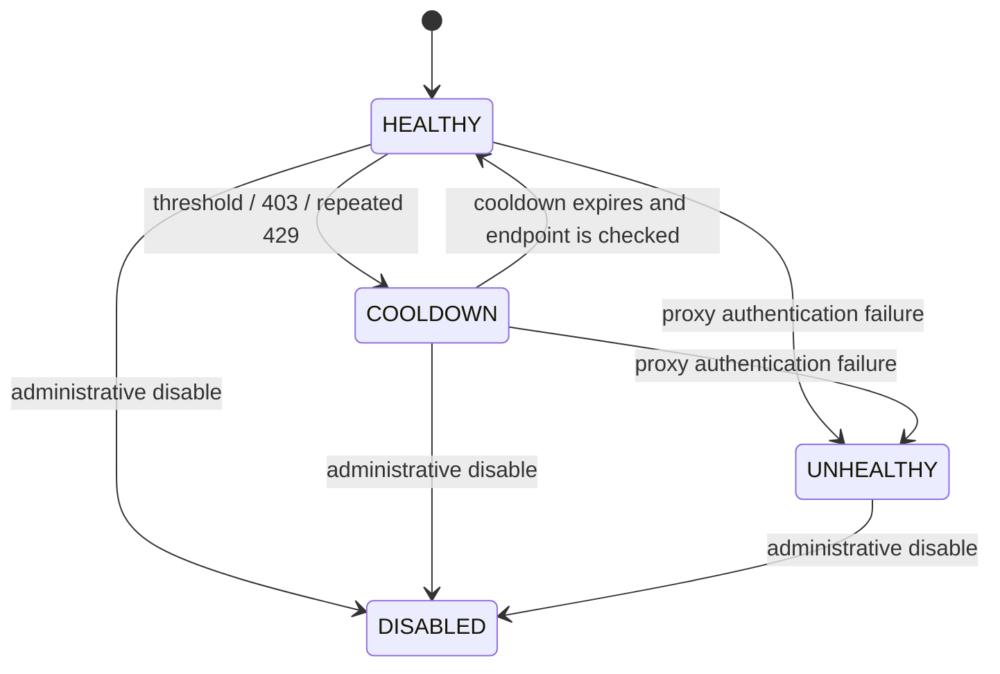

Current v1 behavior has no automatic recovery path from `UNHEALTHY`; an unhealthy endpoint remains unavailable for the life of the pool/process unless future management logic is added.

### 13.3 Selection and rotation

The pool uses round-robin selection across usable endpoints. A context re-acquires its existing active lease, producing sticky behavior. Rotation releases the old lease and then selects another usable endpoint while excluding the old proxy ID from the immediate selection.

If no usable proxy remains:

- with direct fallback enabled, a direct lease can be created;
- with direct fallback disabled, `ProxyUnavailable` is raised.

Rotation is a destructive replacement, not a transactional swap: the old lease is released before replacement acquisition.

### 13.4 Failure semantics

| Failure | Egress action |
| --- | --- |
| Proxied 403 | immediately cooldown the endpoint; rotate only if retryable and another attempt remains |
| Direct 403 | no rotation; terminal with respect to egress |
| Proxied 407 | mark endpoint `UNHEALTHY`; rotate when allowed |
| 429 | increment a dedicated per-egress counter; rotate proxied egress only after configured threshold |
| Proxy connection / timeout / temporary connection / 502 / 504 | feed generic endpoint failure threshold; rotate when threshold is reached and another attempt remains |
| Success | reset provider health for usable proxies and clear that egress's 429 counter |

429 has dedicated accounting and does not also increment the generic proxy failure counter.

## 14. Circuit breaker

The process-wide circuit represents likely **Google Play upstream health**, not individual proxy health.

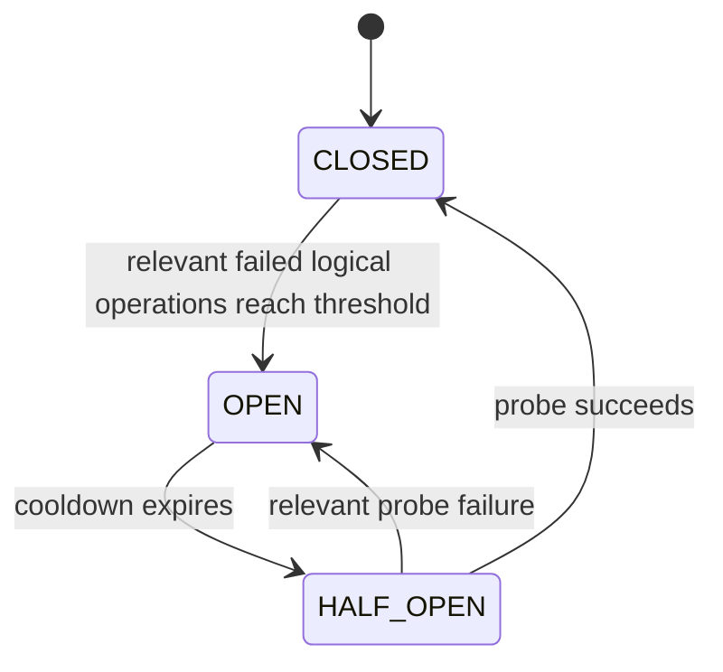

### What counts

Relevant failures include direct/upstream evidence such as:

- `UpstreamFailure` (including gateway subclasses);
- `RateLimited`;
- direct `AccessForbidden`;
- direct `NetworkTimeout`;
- direct `TemporaryConnectionFailure`.

Proxy-attributed access/connection failures are excluded because a bad proxy is not sufficient evidence that Google Play is unavailable.

### Logical-operation accounting

The circuit is updated after the primary retry group has exhausted, not for every physical retry. Three failed HTTP attempts inside one operation normally count as one failed logical operation at the circuit layer.

### Half-open concurrency

Only one half-open probe can be in flight. Other callers fail fast with `CircuitOpen` while that probe is running.

### Stale-call protection

The current implementation assigns a circuit generation token when a logical call is admitted. Opening the circuit increments the generation. Success or failure from an older generation is ignored, preventing an old in-flight result from incorrectly closing a newly opened circuit or extending its new cooldown window.

## 15. HTTP and error semantics

The controlled transport maps HTTP status codes into domain errors before they reach application policy.

| Status | Domain meaning |
| --- | --- |
| `< 400` | success |
| `403` | `AccessForbidden`; retry-with-new-egress only when proxied |
| `404` | `AppNotFound` |
| `407` | `ProxyAuthenticationFailure` |
| `408` | `NetworkTimeout` |
| `410` | `AppGone` |
| `429` | `RateLimited` |
| `451` | `LegalRestriction` |
| `502`, `504` | `GatewayFailure` |
| other `>= 500` | `UpstreamFailure` |
| other `4xx` | `ClientRequestFailure` |

`Retry-After` supports both numeric seconds and HTTP-date form and is looked up case-insensitively.

The `ErrorClassifier` is a second anti-corruption boundary for raw library exceptions. Existing `CrawlerError` instances are preserved; Pydantic validation errors become `SchemaFailure`; known scraper exceptions and messages are mapped into the domain taxonomy; unknown exceptions fail conservatively as generic `CrawlerError` rather than automatically gaining retry/fallback behavior.

## 16. Data normalization

### 16.1 App details

The internal `AppDetailsDTO` requires:

- non-negative install/rating/review counts;
- score between 0 and 5;
- `store_updated_on` as a calendar `date | None`;
- timezone-aware collection timestamp normalized to UTC;
- non-empty source adapter.

`normalize_updated_on` accepts known source forms including aware datetime, date, Unix numeric timestamp, `"Sep 05, 2026"`, and `"2026-09-05"`. Unknown optional strings become `None`; naive datetimes are rejected as ambiguous.

### 16.2 Reviews

Each `ReviewDTO` requires:

- non-empty external review ID;
- timezone-aware source timestamp normalized to UTC;
- score 1 through 5;
- non-negative thumbs-up count;
- position 1 through 1,000;
- timezone-aware observation timestamp;
- source adapter provenance.

All reviews in one collection result share the same `observed_at`, representing the observation batch. Review count is capped at 1,000.

## 17. Kafka ownership and delivery semantics

The crawler produces two versioned event types:

| Event type | Topic | Kafka key |
| --- | --- | --- |
| `playstore.app_stats.collected` | `playstore.app-stats.v1` | application UUID |
| `playstore.review.observed` | `playstore.review-observed.v1` | application UUID |

One app-details task produces one app-statistics event. A reviews task produces one event per review.

The producer uses idempotence and `acks=all`, but the system intentionally does not claim a cross-system exactly-once transaction between PostgreSQL lifecycle updates and Kafka. A task is marked succeeded only after the crawler publisher has passed its Kafka batch flush/delivery boundary.

This means partial publication is possible in failure scenarios, and consumers should be designed with at-least-once delivery in mind.

## 18. PostgreSQL ownership

Crawler tables:

### `crawl_runs`

Records one crawl execution, including trigger, status, schedule time, start/finish timestamps, crawler version, and creation time.

### `crawl_tasks`

Records app/task lifecycle, including run ID, application ID, task type, locale, status, attempt count, first-start time, finish time, and safe error information.

There is a foreign key to `applications.id`, but crawler business logic still obtains active application data via the Registry API. The models import registry models so the shared SQLAlchemy metadata contains the referenced table even in a fresh crawler process.

## 19. Deployment view

The default Compose topology is:

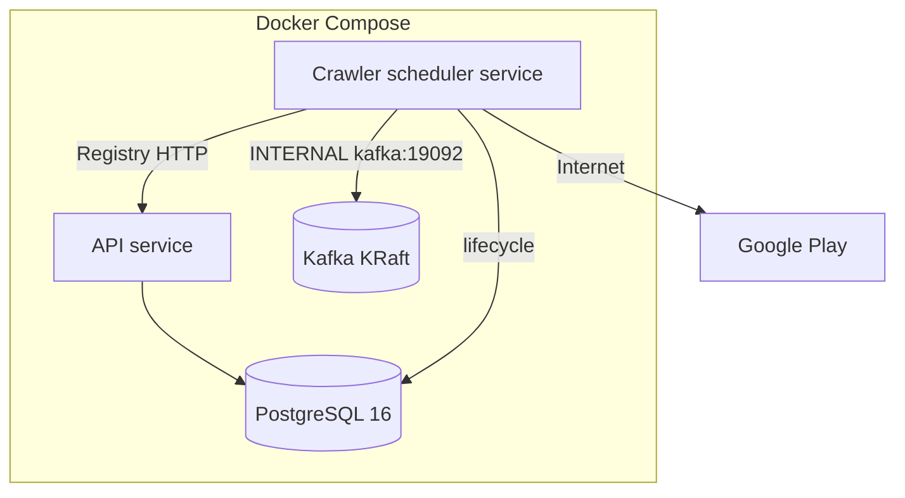

The crawler service depends on healthy Postgres, Kafka, and API containers. Normal crawler startup does not run Alembic or create topics.

## 20. Quality goals

The implementation prioritizes the following qualities.

### Reliability

Transient network/upstream failures are retried within bounds; proxy health and circuit behavior prevent uncontrolled repeated failures; lifecycle state records partial results.

### Controlled outbound behavior

Primary physical requests pass through a shared token bucket, configured timeout, explicit proxy context, and domain HTTP classification.

### Failure transparency

Parser failure, rate limiting, access rejection, proxy auth, missing app, upstream failure, local rate-limit wait, schema failure, and Kafka publication failure remain distinct error categories.

### Testability

Ports, fake clocks, injected factories/fetchers/sessions, and deterministic policy objects allow the majority of behavior to be tested without Google Play or real time delays.

### Maintainability

Third-party shapes are normalized at adapter boundaries and implementation-specific I/O is kept out of domain/application contracts.

### Security of secrets

Proxy URLs use `SecretStr` and safe proxy IDs; persisted error text redacts credential-bearing endpoint URLs.

## 21. Key runtime scenarios

### 21.1 Successful primary request

```text
Circuit admits operation
-> primary adapter created lazily
-> token acquired
-> Google Play response succeeds
-> DTO validation succeeds
-> network health reset
-> circuit reset/closed
-> Kafka delivery succeeds
-> lifecycle task succeeds
```

### 21.2 Transient timeout

```text
physical request times out
-> classified NetworkTimeout
-> NetworkPolicy updates proxy health when applicable
-> RetryPolicy waits and retries if allowed
-> each new physical request needs another token
-> only the final logical failure is counted by the circuit
```

### 21.3 Primary parser drift

```text
primary parser/adapter failure
-> no repeated primary retry
-> fallback policy selects secondary
-> secondary is counted as next logical attempt
-> secondary uses direct third-party network path once
-> success returns the same internal DTO shape
```

### 21.4 Proxied 403

```text
403 on proxy
-> AccessForbidden(retry_with_new_egress=True)
-> current endpoint enters cooldown
-> if another attempt remains, rotate to different egress
-> old primary stack closes
-> new primary stack is built lazily for next attempt
```

### 21.5 Circuit open

```text
before_call sees OPEN inside cooldown
-> CircuitOpen immediately
-> no lifecycle attempt hook fires
-> no token is consumed
-> no HTTP request is sent
-> task can fail with attempt_count = 0
```

## 22. Glossary

| Term | Meaning in this crawler |
| --- | --- |
| **Run** | One full crawler execution across the current active application list. |
| **Task** | One persisted operation for one application: `app_details` or `reviews`. |
| **Logical operation** | One application-level call to collect details or reviews. |
| **Logical attempt** | An attempt counted in task lifecycle. Primary retries and a selected secondary fallback are attempts. |
| **Physical request** | One actual outbound HTTP request. Primary requests are paced by the token bucket. |
| **Egress** | The network exit identity used for a primary request: a proxy endpoint or direct. |
| **Proxy endpoint** | A configured proxy URL plus health state. |
| **Proxy lease** | A sticky context-to-egress binding, not an exclusive reservation. |
| **Primary adapter** | `GPlayScraperAdapter` using controlled Sahabino transport. |
| **Secondary adapter** | `GooglePlayScraperAdapter`, direct-only fallback for parser/schema/known adapter failures. |
| **Fallback** | Switching scraper implementation after a specifically eligible primary adapter failure. |
| **Retry** | Re-running the primary operation after a retryable failure. |
| **Circuit** | Process-wide Google Play health gate: CLOSED/OPEN/HALF_OPEN. |
| **Lifecycle data** | Operational run/task state stored in PostgreSQL. |
| **Collected data** | App/review information published to Kafka. |
| **Observation** | The crawler seeing a review at a particular position and time; represented by a review event. |
