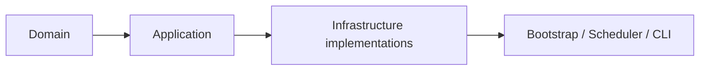
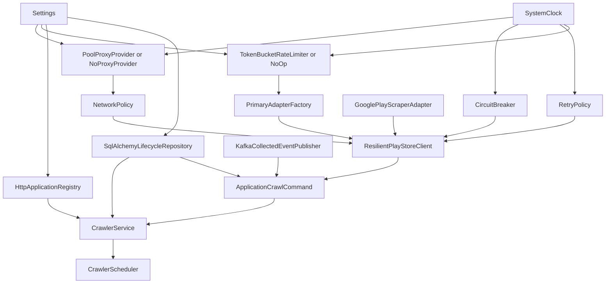
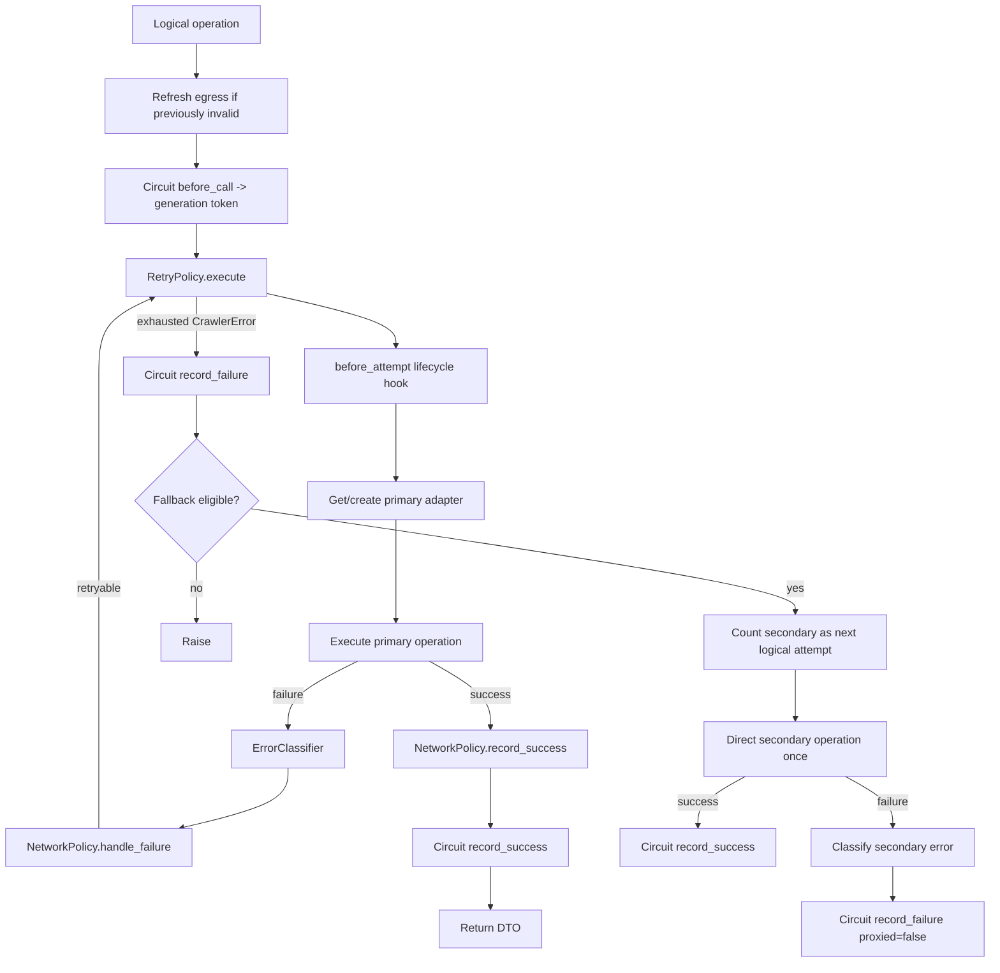

# 02 - Crawler Developer Reference

## 1. Purpose of this document

This document is the code-oriented reference for developers taking ownership of the crawler. It describes the current source tree, dependency direction, important types, runtime composition, and the behavior encoded in each major file.

It intentionally avoids re-teaching general Python syntax. The focus is: **what each unit owns, what it must not own, and how changing it affects the rest of the crawler.**

## 2. Source tree

```text
src/sahabino/crawler/
├── __init__.py
├── __main__.py
├── domain/
│   ├── dto.py
│   ├── errors.py
│   └── results.py
├── application/
│   ├── client.py
│   ├── executor.py
│   ├── tasks.py
│   ├── policies/
│   │   ├── adapter.py
│   │   ├── network.py
│   │   └── retry.py
│   └── ports/
│       ├── adapter.py
│       ├── clock.py
│       ├── lifecycle_repository.py
│       ├── proxy.py
│       ├── publisher.py
│       ├── rate_limiter.py
│       ├── registry.py
│       ├── resilience.py
│       └── transport.py
├── bootstrap/
│   └── container.py
├── infrastructure/
│   ├── http_errors.py
│   ├── adapters/
│   │   ├── classifier.py
│   │   ├── common.py
│   │   ├── factory.py
│   │   ├── google_play.py
│   │   └── gplay.py
│   ├── messaging/
│   │   └── kafka.py
│   ├── persistence/
│   │   ├── models.py
│   │   └── repository.py
│   ├── proxy/
│   │   ├── models.py
│   │   ├── pool.py
│   │   └── providers.py
│   ├── registry/
│   │   └── http.py
│   ├── resilience/
│   │   ├── circuit_breaker.py
│   │   ├── clock.py
│   │   └── token_bucket.py
│   └── transport/
│       ├── controlled_gplay.py
│       └── curl_cffi.py
└── scheduler/
    ├── scheduler.py
    └── worker.py
```

## 3. Dependency direction

The code should be read from the center outward:



That diagram is about conceptual direction; Python imports point inward from outer layers to the contracts they implement/use.

### Domain

Owns stable crawler language: DTOs, error taxonomy, run/task state enums.

### Application

Owns orchestration and decisions: crawl use cases, resilient client, retry/network/fallback policies, and ports.

### Infrastructure

Owns side effects and third-party integration: Google Play libraries, HTTP, proxy pool, SQLAlchemy, Kafka, clock, token bucket, circuit breaker, Registry HTTP.

### Bootstrap/runtime edge

Owns construction and process entry points. `build_container` is the composition root where concrete implementations are selected from settings.

## 4. Composition root

`src/sahabino/crawler/bootstrap/container.py` is the single most useful file for understanding what actually runs in production.



### Resource ownership

`CrawlerContainer` exposes `crawler`, `scheduler`, `registry`, and `publisher`. Closing the container closes the Registry client and, in a `finally`, closes the Kafka publisher so publisher cleanup still runs if Registry close fails.

## 5. Domain reference

### 5.1 `domain/dto.py`

#### `ApplicationRef`

Immutable dataclass carrying:

- `application_id: UUID`
- `name: str`
- `package_name: str`

Name and package must not be blank. This is the application shape the crawler needs from the Registry; it is intentionally smaller than the full Registry model.

#### `AdapterCapabilities`

Immutable capability description:

- `supports_proxy`
- `transport_controlled`
- `supports_reviews`

The current primary and secondary adapters expose these values. They are useful contract metadata; current application orchestration does not dynamically branch on every capability field.

#### `AppDetailsDTO`

Pydantic model, frozen, rejects extra fields. Key validation:

- counts are non-negative;
- score is 0..5;
- `store_updated_on` is date precision;
- `collected_at` must be timezone-aware and is normalized to UTC;
- `source_adapter` must be non-empty.

#### `ReviewDTO`

Pydantic model, frozen, rejects extra fields. Key validation:

- source and observation timestamps must be timezone-aware and are normalized to UTC;
- score is 1..5;
- position is 1..100;
- thumbs-up count is non-negative;
- external ID and source adapter are non-empty.

#### `ReviewsDTO`

Contains a tuple of reviews with maximum length 100.

### 5.2 `domain/errors.py`

The error hierarchy is intentionally granular because policy behavior depends on error meaning.

| Error | Typical owner/meaning |
| --- | --- |
| `RateLimited` | Google Play 429 / scraper rate-limit signal |
| `AccessForbidden` | HTTP 403; may carry `retry_with_new_egress` |
| `NetworkTimeout` | network/HTTP timeout |
| `LocalRateLimitWaitExceeded` | local token bucket could not grant within its wait bound |
| `TemporaryConnectionFailure` | direct/general connection problem |
| `ProxyConnectionFailure` | proxy-specific connection problem |
| `ProxyAuthenticationFailure` | proxy 407; may carry `retry_with_new_egress` |
| `ProxyUnavailable` | no replacement egress is available |
| `UpstreamFailure` | general 5xx |
| `GatewayFailure` | 502/504; also relevant to proxy health accounting |
| `AppNotFound` | 404 / scraper equivalent |
| `AppGone` | 410 |
| `LegalRestriction` | 451 |
| `ClientRequestFailure` | other non-transient 4xx |
| `InvalidPackage` | package validation/library invalid-app signal |
| `ParseFailure` | upstream payload/parser failure |
| `SchemaFailure` | normalized DTO/schema failure |
| `AdapterFailure` | known scraper implementation failure |
| `CircuitOpen` | global circuit denied the operation |
| `RegistryUnavailable` | Registry API unavailable/invalid response |
| `MessagingPublishFailure` | Kafka delivery boundary failure |

`safe_error_message()` strips credential-bearing HTTP/SOCKS URLs, collapses whitespace, and truncates to a configurable maximum (500 by default). Persisted crawler error text must use this safe representation.

### 5.3 `domain/results.py`

Enums:

- `TriggerType`: `scheduled`, `manual`
- `CrawlRunStatus`: `pending`, `running`, `succeeded`, `partially_failed`, `failed`
- `CrawlTaskType`: `app_details`, `reviews`
- `CrawlTaskStatus`: `pending`, `running`, `retrying`, `succeeded`, `failed`

## 6. Application ports

Ports are Python `Protocol`s. Their purpose is to define what application logic needs without binding it to concrete libraries.

| Port | File | Contract purpose |
| --- | --- | --- |
| `PlayStoreAdapter` | `ports/adapter.py` | normalized app/review collection and close |
| `PrimaryAdapterFactoryPort` | `ports/adapter.py` | create primary adapter for context + lease |
| `Clock` | `ports/clock.py` | monotonic time and sleep |
| `LifecycleTransaction` / `LifecycleRepository` | `ports/lifecycle_repository.py` | transactional run/task state operations |
| `ProxyLeasePort` / `ProxyProvider` | `ports/proxy.py` | egress identity, health, rotation, lifecycle |
| `CollectedEventPublisher` | `ports/publisher.py` | publish app stats/reviews and close |
| `GlobalRateLimiter` | `ports/rate_limiter.py` | acquire one physical-request permit |
| `ApplicationRegistryPort` | `ports/registry.py` | list active applications |
| `ErrorClassifierPort` | `ports/resilience.py` | raw exception -> `CrawlerError` |
| `CircuitBreakerPort` | `ports/resilience.py` | call admission and result accounting with generation token |
| `HttpTransport` | `ports/transport.py` | one physical HTTP request and close |

A maintainer should preserve the distinction between a port and a policy. For example, `RetryPolicy` is application logic and therefore a concrete application type; `HttpTransport` is an external-I/O capability and therefore a port.

## 7. `application/executor.py` - run orchestration

### `CrawlerService.crawl_once`

High-level algorithm:

```text
create RUNNING run and commit
try Registry list_active_applications
    on registry failure:
        force run FAILED
        return run_id
create two tasks per app and commit
create bounded executor
submit one ApplicationCrawlCommand per app
wait on all futures
finalize run from task statuses
on unexpected orchestration/worker failure:
    force run FAILED
    preserve finalization error with ExceptionGroup if needed
    re-raise
return run_id
```

#### Important behavior

- Registry failure is deliberately converted into a failed persisted run and the run ID is returned.
- Task creation failure or unexpected worker/executor failure forces the run failed and propagates the exception.
- Worker concurrency is bounded by `max_concurrent_apps`.
- Each future corresponds to one whole application command, not one details/reviews task.
- The executor context waits for running workers to clean up before shutdown.
- Normal final status is computed by the repository from task statuses.

## 8. `application/tasks.py` - per-application command

`ApplicationCrawlCommand` owns the two tasks for one application.

### Execution order

```text
open application network context
-> run details
-> run reviews
-> close application context
```

### Expected failures

A `CrawlerError` inside `_run_details` or `_run_reviews` is persisted as a failed task and is not automatically raised out of the task method. This enables partial success.

### Unexpected failures

Non-`CrawlerError` exceptions are persisted with generic crawler error code, then propagated. The outer `execute` path attempts to mark any still-open tasks failed. If failure handling itself fails, `ExceptionGroup` preserves both causes.

### Hooks

`OperationHooks` connect resilient-client attempt/retry events to lifecycle transitions without making the client depend on SQLAlchemy:

```text
before_attempt -> begin_attempt -> RUNNING, attempt_count + 1
before_retry   -> mark_retrying -> RETRYING
```

## 9. `application/client.py` - resilience orchestrator

This file is the heart of Play Store operation control.

### `ResilientPlayStoreClient`

Shared facade containing shared policy/dependency objects. `open_application(context_id)` acquires a lease, builds `ApplicationPlayStoreClient`, yields it, and always closes it.

### `ApplicationPlayStoreClient`

Application-scoped state:

- `context_id`
- current lease
- lazy primary adapter
- `refresh_egress_before_operation` flag

The same instance is used for details and reviews so network state is preserved between operations.

### Resource cleanup

`close()` clears the cached primary reference, attempts primary close, and releases the current lease in a `finally`. This guarantees lease release even when adapter close itself raises.

### `_execute`

Conceptual pipeline:



### Circuit call token

`before_call()` returns the current circuit generation. The same token is supplied to result-recording calls. This is essential under concurrency: a result from a call admitted before the circuit opened cannot later overwrite the newer circuit generation's state.

### Proxy rotation and primary stack lifetime

When `NetworkPolicy` returns a different lease, the old primary adapter is closed, `_primary` is cleared, and the new lease becomes current. The next attempt lazily creates a new stack from the new lease.

When the current lease becomes unusable but no rotation should happen inside the exhausted operation, `_refresh_egress_before_operation` forces the next logical operation to rotate before doing work.

### Special `ProxyUnavailable` handling for 403

When a proxied access-forbidden case requires new egress but no replacement exists, the client preserves the meaningful `AccessForbidden` error, disables `retry_with_new_egress`, and flags egress refresh for the next operation instead of replacing the failure with a generic proxy-unavailable meaning.

### Primary vs secondary success accounting

Primary success calls both:

- `NetworkPolicy.record_success(current_lease)`
- `CircuitBreaker.record_success(call_token)`

Secondary success calls only circuit success. It does not mark the primary lease healthy because the secondary did not use that lease.

## 10. Application policies

### 10.1 `policies/adapter.py`

`AdapterFallbackPolicy` answers exactly one question: should this error select the secondary adapter?

Eligible only when secondary is enabled and the error is one of:

- `ParseFailure`
- `SchemaFailure`
- `AdapterFailure`

### 10.2 `policies/retry.py`

`RetryPolicy` owns retryability, attempt count, delay, and Tenacity integration.

#### Retryability

Always retryable categories:

- `RateLimited`
- `NetworkTimeout`
- `TemporaryConnectionFailure`
- `ProxyConnectionFailure`
- `UpstreamFailure`

Conditional:

- `AccessForbidden`
- `ProxyAuthenticationFailure`

The conditional types retry only when `retry_with_new_egress=True`.

#### Delay

```text
local_backoff = min(2^(attempt_number - 1) + random_jitter, max_delay)
if RateLimited/UpstreamFailure has Retry-After:
    delay = max(local_backoff, retry_after)
else:
    delay = local_backoff
```

The server minimum may exceed the configured local cap.

Tenacity is contained in this policy; the rest of the application does not import Tenacity types.

### 10.3 `policies/network.py`

`NetworkPolicy` owns egress health decisions, not retry timing.

#### 403

- direct: keep lease;
- proxied: cooldown immediately; rotate only when `allow_rotation`.

#### 407

- direct: keep lease;
- proxied: mark unhealthy; rotate only when allowed.

#### 429

- count per `proxy_id` or `"direct"`;
- on proxied threshold: cooldown and optionally rotate;
- do not also increment generic provider failure accounting;
- success clears the egress-specific 429 counter.

#### Connection-like failures

`ProxyConnectionFailure`, `NetworkTimeout`, `TemporaryConnectionFailure`, and `GatewayFailure` feed provider failure accounting. Rotation occurs only when provider threshold is reached and rotation is allowed.

## 11. Primary adapter stack

### 11.1 `infrastructure/adapters/factory.py`

`PrimaryAdapterFactory.create(context_id, lease)` wires:

```text
ProxyLease
-> NetworkContext
-> CurlCffiTransport(shared rate limiter, timeout)
-> ControlledGPlayHttpClient(gplay config)
-> GPlayScraperAdapter
```

The public annotation accepts `ProxyLeasePort`, but the concrete factory requires the project's `ProxyLease`. This is an intentional/current infrastructure constraint and limits substitutability of alternate lease implementations.

### 11.2 `infrastructure/adapters/gplay.py`

`GPlayScraperAdapter` is the controlled primary.

Capabilities:

```text
supports_proxy = true
transport_controlled = true
supports_reviews = true
```

#### Version guard

Runtime checks `gplay-scraper==1.0.6`. The integration uses private/internal behavior and therefore fails loudly if a different installed version is present.

#### Controlled integration technique

The adapter intentionally:

- constructs `AppScraper` and `ReviewsScraper` with `object.__new__` instead of their normal constructors;
- injects Sahabino's controlled HTTP client;
- calls `inspect.unwrap` on decorated scraper methods to bypass library retry/rate-limit/backend wrappers.

This is unusual code by design. Removing these steps without re-validating network behavior can reintroduce hidden retry or alternate HTTP paths.

#### App normalization

Raw keys map into Sahabino DTO names, e.g.:

```text
minInstalls -> min_installs
ratings     -> ratings_count
reviews     -> reviews_count
updated     -> store_updated_on
adSupported -> ad_supported
```

`source_adapter` is `gplay-scraper`.

#### Reviews

- validates package name;
- caps limit at 100;
- calls unwrapped reviews scraper with fixed sort value `2` as required by the pinned integration;
- expects a dict containing a list under `reviews`;
- decodes Google batch responses via `decode_gplay_review_response`;
- extracts raw fields through pinned `ElementSpecs.Review`;
- extracts source timestamp from the pinned nested item shape and creates UTC datetimes;
- assigns positions starting at 1;
- uses one `observed_at` value for the batch.

#### Batch response decoder

`decode_gplay_review_response` requires the Google response marker, JSON-decodes the outer payload and nested inner payload, and returns review item data. Malformed JSON is intentionally allowed to surface as raw JSON errors so `ErrorClassifier` can map it at the application boundary.

### 11.3 `infrastructure/transport/controlled_gplay.py`

`ControlledGPlayHttpClient` is the only HTTP-facing object exposed to the pinned primary scraper components.

It provides the method shapes expected by that library:

- `fetch_app_page`
- `fetch_app_page_no_locale`
- `fetch_reviews_batch`

The reviews request constructs the current opaque Google `batchexecute` form payload including RPC ID `oCPfdb`, app ID, sort, count/page/token, and `hl`/`gl` query parameters.

It delegates every network operation to the `HttpTransport` port and performs no retries or fallback itself.

`headers or self.headers` means an explicitly empty header mapping currently falls back to the configured default headers; tests characterize this behavior.

### 11.4 `infrastructure/transport/curl_cffi.py`

`CurlCffiTransport` performs one physical request.

Per request:

1. reject requests after close;
2. acquire one global rate-limit token;
3. build headers/body/query parameters;
4. reveal the proxy secret only inside transport and pass it when non-direct;
5. call the `curl_cffi` session;
6. translate raw connection errors;
7. classify HTTP response status;
8. return a framework-neutral `TransportResponse` on success.

The default session uses `curl_cffi.requests.Session(impersonate="chrome")`.

Close is idempotent.

#### Raw transport exception taxonomy

The current translator is string/name based:

- any text containing `timeout` -> `NetworkTimeout`;
- proxied `proxy` / `connect` / `resolve` -> `ProxyConnectionFailure`;
- direct/general `connect` / `network` / `resolve` -> `TemporaryConnectionFailure`;
- otherwise -> `TemporaryConnectionFailure`.

This is intentionally documented as an implementation-risk area because library message changes can affect classification.

## 12. Secondary adapter

### `infrastructure/adapters/google_play.py`

`GooglePlayScraperAdapter` uses `google-play-scraper==1.2.7` from project dependencies.

Capabilities:

```text
supports_proxy = false
transport_controlled = false
supports_reviews = true
network_mode = DIRECT_ONLY
```

The wrapper itself keeps only fetcher callables and a `now` callable; it does not store per-request application/page state.

### App path

Uses `google_play_scraper.app`, then normalizes into the same `AppDetailsDTO` schema as primary. It supports `updated` and fallback field `lastUpdatedOn` for update-date compatibility.

### Review path

The default implementation uses private library APIs:

- `google_play_scraper.features.reviews._fetch_review_items`
- `ElementSpecs.Review`

It requests `Sort.NEWEST`, caps at 100, discards continuation state, and normalizes timestamps/fields into `ReviewDTO`.

The secondary has no adapter-owned persistent session to close, so `close()` is a no-op.

### Important network implication

The secondary does not receive `NetworkContext`, proxy lease, Sahabino transport, or Sahabino token bucket. Its direct-only network behavior comes from this absence of injection, not from runtime inspection of `network_mode` by the application layer.

## 13. Shared adapter helpers and classifier

### 13.1 `infrastructure/adapters/common.py`

`validate_package` uses a package-name regex requiring a leading letter and at least one dot-separated suffix.

`normalize_updated_on` behavior:

| Input | Result |
| --- | --- |
| `None` / `"Never updated"` | `None` |
| aware `datetime` | UTC calendar date |
| naive `datetime` | `SchemaFailure` |
| `date` | same date |
| int/float Unix time | UTC date |
| `"%b %d, %Y"` | parsed date |
| `"%Y-%m-%d"` | parsed date |
| unknown string/object | `None` |

### 13.2 `infrastructure/adapters/classifier.py`

`ErrorClassifier` is an anti-corruption layer between raw library exceptions and application policy.

Order matters:

1. preserve existing `CrawlerError` object;
2. Pydantic `ValidationError` -> `SchemaFailure`;
3. extract `status_code` or `code`, parse Retry-After when possible, and reuse HTTP status mapping;
4. known library names:
   - `InvalidAppIdError` -> `InvalidPackage`
   - `AppNotFoundError` / `NotFoundError` -> `AppNotFound`
   - `DataParsingError` / `JSONDecodeError` -> `ParseFailure`
   - `RateLimitError` / message containing `429` -> `RateLimited`
5. message/name heuristics:
   - `proxy` -> `ProxyConnectionFailure`
   - `timeout` -> `NetworkTimeout`
   - `connection` / `network` -> `TemporaryConnectionFailure`
6. `IndexError`, `KeyError`, `TypeError` -> `AdapterFailure`;
7. unknown -> generic `CrawlerError`.

The final generic mapping is conservative: it intentionally does not grant unknown exceptions automatic retry or secondary fallback.

## 14. HTTP error helpers

`infrastructure/http_errors.py` centralizes mapping shared by controlled transport and raw exception classification.

### Retry-After

- numeric seconds supported;
- HTTP-date supported;
- naive/unparseable dates return `None`;
- past date returns zero;
- header name is case-insensitive.

### Status matrix

See the architecture document for the full table. The important design point is that HTTP meaning is retained rather than collapsing everything into a generic scraper error.

## 15. Proxy implementation reference

### 15.1 `infrastructure/proxy/models.py`

#### `ProxyEndpoint`

Mutable endpoint state:

- safe ID (`proxy-N`)
- secret URL (`SecretStr`, omitted from repr)
- state
- generic failure count
- optional cooldown deadline

`usable(now)` lazily restores expired cooldown endpoints to healthy state by calling `record_success`.

`UNHEALTHY` and `DISABLED` do not recover through `record_success`.

#### `ProxyLease`

Mutable context binding:

- `context_id`
- endpoint or direct (`None`)
- acquisition monotonic timestamp
- released flag

The URL can only be revealed by `secret_url()`.

#### `NetworkContext`

Frozen pair of `context_id` and concrete `ProxyLease`, passed into the transport stack.

### 15.2 `infrastructure/proxy/pool.py`

Pool state:

- endpoint list;
- threshold/cooldown settings;
- direct-fallback flag;
- per-context lease map;
- round-robin next index;
- `RLock`.

`RLock` matters because `rotate()` holds the lock and calls `release()` and `acquire()`, which also lock.

#### Acquire

- reuse active lease for the same context;
- otherwise choose next usable endpoint round-robin;
- optionally exclude old proxy ID during rotation;
- create direct lease if no proxy is usable and direct fallback is enabled;
- otherwise raise `ProxyUnavailable`.

#### Rotate

- save old proxy ID;
- release old lease;
- acquire replacement excluding old proxy ID.

#### Health methods

Delegate state transitions to the endpoint under lock.

#### Encapsulation note

`endpoints` returns a tuple, but the tuple contains the live mutable `ProxyEndpoint` objects. This is useful to tests/inspection but means callers can mutate endpoint state outside pool methods/locking if they choose to do so.

### 15.3 `infrastructure/proxy/providers.py`

#### `NoProxyProvider`

Null-object/direct provider. It still maintains sticky per-context direct leases so the application lifecycle contract is identical whether proxy mode is enabled or not.

#### `PoolProxyProvider`

Thin port adapter delegating to `ProxyPool`.

#### `StaticProxyProvider`

Convenience specialization backed by a one-endpoint `ProxyPool`. The current production composition root uses `PoolProxyProvider` or `NoProxyProvider`; `StaticProxyProvider` is available and tested but is not selected directly by current settings wiring.

The providers enforce the concrete `ProxyLease` implementation through `_concrete`, another current extensibility constraint.

## 16. Resilience implementation reference

### 16.1 `resilience/clock.py`

`SystemClock` wraps:

- `time.monotonic()` for elapsed-duration logic;
- `time.sleep()` for waits.

The `Clock` port enables deterministic tests of retry, proxy cooldown, token refill, and circuit cooldown.

### 16.2 `resilience/token_bucket.py`

`NoOpRateLimiter` is the disabled implementation.

`TokenBucketRateLimiter`:

- starts full;
- supports fractional tokens;
- lazily refills from elapsed monotonic time;
- caps refill at capacity;
- uses a lock for shared-thread correctness;
- sleeps outside the lock;
- loops after waking because another thread may consume the available token;
- enforces one absolute per-acquire deadline;
- raises `LocalRateLimitWaitExceeded` if the next token would arrive beyond the deadline;
- never refunds consumed request tokens.

`available_tokens` performs a lazy refill before returning the current amount.

### 16.3 `resilience/circuit_breaker.py`

Internal state:

- `CLOSED`, `OPEN`, `HALF_OPEN`;
- relevant consecutive failure count;
- open timestamp;
- half-open probe flag;
- generation token;
- lock.

#### Admission

- disabled -> allow with `None` token;
- OPEN inside cooldown -> `CircuitOpen`;
- OPEN after cooldown -> HALF_OPEN;
- HALF_OPEN with probe already running -> `CircuitOpen`;
- otherwise admit and return generation.

#### Result recording

- stale generation -> ignore;
- success -> reset CLOSED;
- failure while already OPEN -> ignore;
- irrelevant failure -> release half-open probe flag without changing health count;
- relevant HALF_OPEN failure -> open immediately;
- relevant CLOSED failure -> increment and open at threshold.

Proxy-attributed access/timeout/temporary connection failures are not global circuit evidence.

## 17. Registry infrastructure

### `infrastructure/registry/http.py`

`HttpApplicationRegistry` uses an injected HTTP client contract; default implementation is `httpx.Client`.

`list_active_applications()`:

- GET `/applications` with `active=true`;
- retry locally up to configured attempts (default 3);
- bounded backoff `1`, `2`, up to 4 seconds for additional attempts;
- treat >=500 and other non-200 statuses as Registry failures;
- require a list response;
- normalize each item to `ApplicationRef` and validate UUID/name/package.

This retry is intentionally local to the Registry adapter; it is separate from Google Play `RetryPolicy`.

## 18. Persistence reference

### 18.1 `infrastructure/persistence/models.py`

`CrawlRun` and `CrawlTask` use shared project `Base`.

The module imports `sahabino.app_registry.models` so the `applications` table is registered in shared SQLAlchemy metadata when crawler persistence is imported in a fresh process. This is required for the `crawl_tasks.application_id -> applications.id` foreign key to resolve.

### 18.2 `infrastructure/persistence/repository.py`

`SqlAlchemyLifecycleRepository.transaction()` is a context manager yielding a transaction facade. It rolls back automatically on exceptions; individual caller methods explicitly call `commit()` at desired lifecycle boundaries.

`SqlAlchemyLifecycleTransaction` validates legal state transitions before mutation.

#### Run finalization algorithm

If no forced status is supplied:

```text
no tasks OR all succeeded -> SUCCEEDED
all failed                -> FAILED
otherwise                 -> PARTIALLY_FAILED
```

Every finalized run receives `finished_at`.

#### Task transitions

- begin: only `PENDING` or `RETRYING` -> `RUNNING`;
- retrying: only `RUNNING` -> `RETRYING`;
- success: only `RUNNING` -> `SUCCEEDED`;
- failure: `PENDING`, `RUNNING`, or `RETRYING` -> `FAILED`.

Error message is truncated to 500 characters in the repository as a second bound after safe message generation.

## 19. Messaging reference

### 19.1 `infrastructure/messaging/kafka.py`

`KafkaCollectedEventPublisher` converts crawler DTOs into messaging contracts.

#### App details

Builds one `AppStatsCollectedV1`, wraps it in `playstore.app_stats.collected` envelope, and publishes one keyed message to `playstore.app-stats.v1`.

#### Reviews

Builds one `ReviewObservedV1` and one Kafka message per review. All use application UUID string as message key and topic `playstore.review-observed.v1`.

Empty reviews produce an empty message tuple; the underlying batch publication still reaches the producer's flush boundary.

`ProducerError` is translated to `MessagingPublishFailure` so task-level application code receives a crawler-domain error.

### 19.2 Shared messaging contracts

`src/sahabino/messaging/playstore_events.py` defines version-1 payload models and envelopes. Event timestamps are required to be timezone-aware and normalized to UTC.

`src/sahabino/messaging/producer.py` uses:

- Kafka producer idempotence;
- `acks=all`;
- UTF-8 non-blank keys;
- bounded handling of local producer queue-full conditions;
- explicit batch flush/delivery boundary;
- delivery callback error aggregation.

This is reliable producer behavior, but it is not a database+Kafka atomic transaction.

## 20. Scheduler and process entry points

### `crawler/__main__.py`

CLI accepts exactly:

- `crawl-once`
- `scheduler`

`crawl-once` prints the run UUID. There is a current source TODO to replace simple printing with a logging system.

### `scheduler/scheduler.py`

`CrawlerScheduler` validates interval >= 1 minute.

`run_scheduled_once` takes a non-blocking in-process lock. If another scheduled run is active, it returns `None` instead of starting another run. The lock is released in `finally`, including after crawl failure.

APScheduler configuration:

- interval trigger;
- `max_instances=1`;
- `coalesce=True`;
- first run at current UTC time;
- blocking scheduler in UTC.

### `scheduler/worker.py` and `crawler/__init__.py`

Small convenience wrappers for manual `crawl_once` invocation without coupling the use case to scheduler mechanics.

## 21. Settings reference

All crawler settings are `SAHABINO_`-prefixed through Pydantic Settings. See the operations guide for a full table.

Important validation:

- numeric limits use Pydantic lower bounds;
- locale codes are regex-constrained;
- blank proxy URLs are rejected;
- proxy mode with no proxy URLs is valid only when direct fallback is enabled.

Proxy URLs use `SecretStr` at the Settings boundary.

## 22. Extension guidelines

### Adding another Play Store adapter

1. Implement `PlayStoreAdapter` and return the existing normalized DTOs.
2. Make network capabilities explicit.
3. Decide whether it is a primary candidate or fallback only.
4. Extend `AdapterFallbackPolicy` only if there is a clear error semantic that justifies switching implementation.
5. Add semantic-parity tests against existing adapters.
6. Do not allow a new adapter to silently introduce hidden retries or unbounded pagination.

### Adding another proxy provider

The application port is simple, but current infrastructure factory/provider helpers assume concrete `ProxyLease`. A truly alternate lease implementation would require widening `NetworkContext`, `PrimaryAdapterFactory`, and `_concrete` boundaries rather than only implementing the Protocol.

### Adding an error type

Trace it through all policy owners:

- HTTP/raw classification;
- `RetryPolicy`;
- `NetworkPolicy`;
- `AdapterFallbackPolicy`;
- `CircuitBreaker` relevance;
- persisted error code/message;
- tests for both direct and proxied semantics where applicable.

### Changing retry behavior

Do not add retry loops in transport or scraper adapters. Keep physical I/O single-attempt and change `RetryPolicy`/NetworkPolicy behavior at the application layer.

### Changing crawler persistence

Keep collected-data persistence separate unless architecture intentionally changes. Lifecycle repository is currently for operational execution state only.

## 23. File responsibility index

| File | Primary responsibility |
| --- | --- |
| `crawler/__main__.py` | CLI process entry |
| `application/executor.py` | whole-run orchestration and application concurrency |
| `application/tasks.py` | two independent persisted tasks per application |
| `application/client.py` | per-operation resilience orchestration and application-scoped network state |
| `application/policies/adapter.py` | secondary-fallback eligibility |
| `application/policies/retry.py` | retryability, attempts, delay, Tenacity integration |
| `application/policies/network.py` | egress health and rotation decisions |
| `application/ports/*` | application-facing capability contracts |
| `domain/dto.py` | normalized collection contracts |
| `domain/errors.py` | crawler failure taxonomy and safe error text |
| `domain/results.py` | lifecycle enum values |
| `bootstrap/container.py` | concrete runtime wiring |
| `adapters/gplay.py` | controlled primary parser/scraper normalization |
| `adapters/google_play.py` | direct-only secondary normalization |
| `adapters/factory.py` | build primary network stack from lease |
| `adapters/classifier.py` | raw third-party exception normalization |
| `adapters/common.py` | package/update-date normalization helpers |
| `transport/controlled_gplay.py` | pinned gplay HTTP surface and batch request shape |
| `transport/curl_cffi.py` | one controlled physical HTTP request |
| `http_errors.py` | shared HTTP and Retry-After semantics |
| `proxy/models.py` | endpoint/lease state model |
| `proxy/pool.py` | selection, stickiness, health, rotation |
| `proxy/providers.py` | application-port proxy provider implementations |
| `resilience/token_bucket.py` | process-wide primary request pacing |
| `resilience/circuit_breaker.py` | process-wide upstream availability gate |
| `resilience/clock.py` | production monotonic clock/sleep |
| `registry/http.py` | active application retrieval over HTTP |
| `persistence/models.py` | crawler lifecycle ORM tables |
| `persistence/repository.py` | transactional lifecycle state machine |
| `messaging/kafka.py` | DTO -> Kafka event publication |
| `scheduler/scheduler.py` | periodic trigger and overlap prevention |
